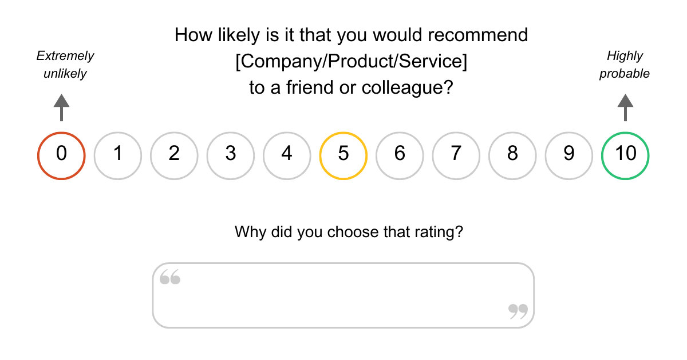
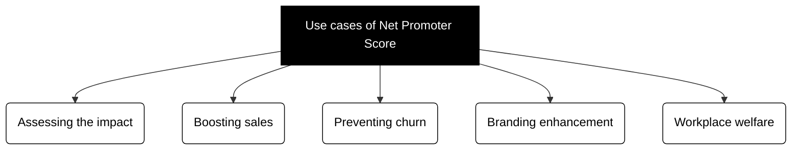
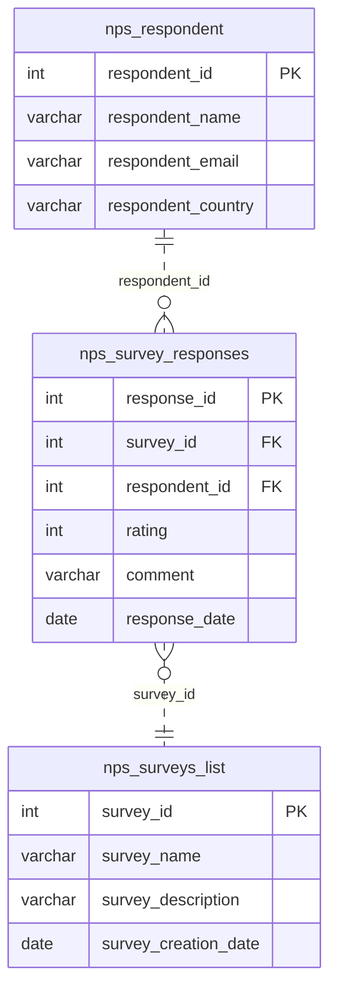
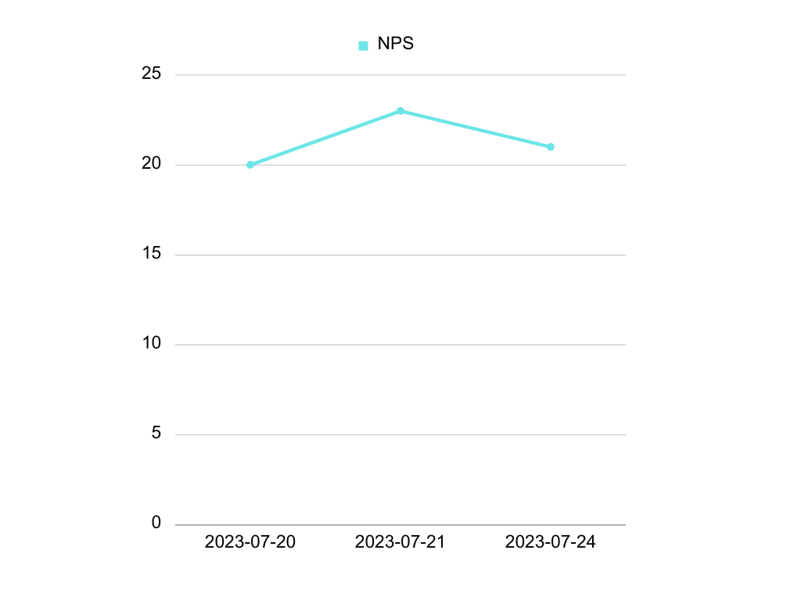

# METRIC: Net Promoter Score (NPS) 

| Details                  | Information              |
| ------------------------ | ------------------------ |
| Metric Title             | Net Promoter Score (NPS) |
| Metric Short Description | KPI to measure customer advocacy and loyalty. |
| Metric Long Description  | NPS is a metric based on a survey question that enables companies analyze the perceived value of a brand, product or service and assess the impact of their offerings. |
| Metric SME               | Jasson Ji                |
| Product Owner            | Uddipan                  |
| Documentation Status     | IN PROGRESS              |

Discover how customers feel about a brand, product or service with this metric.

This document explains the **definition of Net Promoter Score and its relevance** for businesses. It also covers the basics of its implementation and provides instructions with sample codes to **calculate NPS using SQL**.


## What is Net Promoter Score (NPS)?

Net Promoter Score<sup>®</sup>, also known as NPS<sup>®</sup><sup id="fnref-1"><a href="#footnote-1">1</a></sup>, is a key performance indicator that enables businesses to **measure customer loyalty**. It was introduced by Fred Reichheld in his 2003 Harvard Business Review article, *The One Number You Need to Grow*<sup id="fnref-2"><a href="#footnote-2">2</a></sup>.

Nowadays it is a widely used customer experience metric that helps organizations understand if their products and services are meeting the users' expectations by asking **one survey question**:

!!! quote

    On a scale of 0 to 10, how likely is it that you would recommend Company/Product/Service to a friend or colleague?


<figure markdown>
  
  <figcaption>Example of an NPS survey</figcaption>
</figure>


**Respondents are divided into 3 categories** based on their rating:

| Rating | Category   | Description | 
| ------ | ---------- | ----------- |
| 0-6    | Detractors | Respondents who are unsatisfied and may express negative opinions. |
| 7-8    | Passives   | Respondents who are satisfied, but not enthusiastic. |
| 9-10   | Promoters  | Respondents who are passionate and inclined to bring in new customers. |

Many NPS surveys often complement this quantitative measure with an additional question that allows respondents to justify their rating by writing a short text. This is another relevant source of information that companies can use to understand their performance in a more detailed way.


### How to measure NPS

Once the results from the survey question are ready, calculating the Net Promoter Score is rather straightforward—you just need to subtract the percentage of Detractors from the percentage of Promoters:

!!! note

    NPS = % Promoters - % Detractors


**The resulting NPS value ranges from -100 to +100**. The higher the score, the stronger the level of customer advocacy.

However, if the NPS value falls into negative territory, which means that Detractors outnumber Promoters, that clearly indicates that there are opportunities for improvement.

There are online tools that can help you with this process. For example, Qualtrics has an NPS Calculator on their website<sup id="fnref-3"><a href="#footnote-3">3</a></sup>.

!!! info

    If the survey feedback is stored in a database, **NPS can also be calculated using SQL (Structured Query Language)**. Keep reading to learn more about this later or [jump to that section](#calculate-net-promoter-score-using-sql).


## Business use cases of NPS

The widespread fame of Net Promoter Score across businesses can be attributed to its remarkable relevance and practical utility in various scenarios.

Below are **some important use cases of NPS for companies**:



- **Assessing the impact:** Identifying the NPS value can help organizations **learn about the utility and perceived value of their offerings**, and use this feedback to improve their products and services.

- **Boosting sales:** By having specific data about the percentage of respondents, companies can focus on **addressing the specific concerns of Detractors and Passives to turn them into Promoters** and increase positive word-of-mouth.
  
- **Preventing churn:** It prevents customer loss because having a high number of Detractors could lead to a decrease in revenue. This way, NPS **contributes to the long-term survival of a business**.

- **Branding enhancement:** Since Net Promoter Score is widely adopted by many companies, achieving a high score increases recognition and reinforces the brand. It can also be **used to obtain a greater promotional performance** and stand out from the competition.

- **Workplace wellfare:** Companies can also use NPS to **increase the satisfaction and advocacy of employees**. This is known as eNPS (employee Net Promoter Score)<sup id="fnref-4"><a href="#footnote-4">4</a></sup>. It can become an essential metric to evaluate the overall level of internal engagement and increase talent retention and efficiency.

It is important to keep in in mind that, while NPS holds a significant value as a resource for businesses, **its full potential is reached when combined with other customer feedback metrics**.

Besides, **NPS should be used periodically in order to gather accurate data over time**. You could also include it as a part of a transactional process by sending a survey every time a specific product is sold.


## NPS Implementation

There are different ways to implement Net Promoter Score. These are some of them:

1. Use specialized software or an advanced development that is designed specifically for NPS configuration (e.g. Qualtrics<sup id="fnref-5"><a href="#footnote-5">5</a></sup>). **This option can help automate procedures and collect more accurate, reliable and actionable information**.

2. Send an email with an NPS survey question to potential respondents and ask them to reply directly to that email with their rating.

3. Build a questionnaire with a survey app or a form builder (e.g. Google Forms<sup id="fnref-6"><a href="#footnote-6">6</a></sup>).


### Data Sources required to implement NPS

There are different ways set up a Net Promoter Score implementation. Depending on your needs, you might just need to send a simple survey. However, you will probably use a more advanced configuration with different NPS surveys that are delivered periodically.

**To calculate the NPS data using SQL, you must obtain the respondents' information, such their rating and comments, from data sources**. But you can also use further details about each participant to classify their answers in a more targeted and practical way.

!!! info

    Data sources in SQL in this case refers to the information that is stored in a relational database, which can be retrieved by executing SQL queries.


These are the **required data sources** to which you must have access if you want to calculate the NPS value properly:

1. **Respondent identification:** The ID of each person that answers the NPS survey is the primary key that is needed. This should preferrabllly be a number instead of a name, an email or any other text, because the textual identification could change over time, whereas an ID number can remain inmutable.

2. **Respondent rating:** Another source of information that is required to integrate the Net Promoter Score metric is the score provided by each respondent. This is the crucial numerical data that you need to extract the final NPS value.

You may also want to obtain **additional optional information** to complement your reporting and make the most of the NPS experience by using more accurate and practical data, such as:

- **Textual feedback:** Although the NPS value is a number, it is also possible to gather information from a form field where respondents can write text to justify their answer. It is also possible to extract valuable insights with SQL from this data source.

- **Date:** The day or timestamp that the survey question was created, sent or submitted is another relevant piece of information that can give organizations a clearer idea of the evolution of the participants' feedback, especially if NPS surveys are sent periodically.

- **Respondent background:** Other aspects you may want to consider are the country, age, name and email, or any other relevant criteria of the participants' profile, to detect trends about the company's products and services in a more segmented way. The more detailed the data, the more refined solutions you could put in place.

Every business has its own needs, but many may share similar NPS data sources. For example, there could also be a table in the database that stores the information of each survey to keep track of different dates, software version, purposes and strategies.


### Example of an NPS Data Source configuration

!!! example 

    This section introduces a complementary sample scenario that can serve as a reference to understand **a more comprehensive Net Promoter Score implementation using three tables as SQL Data Sources**.

**Table 1: NPS Respondent**

This table would have all **the information about every person who submits an NPS survey**, such as the unique identifier, the name, the email, the country or any other related data.

Thus, the name of this table could be `nps_respondent`, and it would look similar to this:

| respondent_id | respondent_name | respondent_email | respondent_country | 
| ------------- | --------------- | ---------------- | ------------------ |
| 1             | Michael Doe     | mike@example.com | England            |
| 2             | Jonathan Pérez  | jona@example.com | Spain              |
| 3             | Sophie Larsson  | soph@example.com | Australia          |

!!! tip
    Use column names that match your data. For example, if your NPS surveys are only targeting customers, you could use `customer_id` rather than `respondent_id`, `customer_name` instead of `respondent_name`, etcetera.


**Table 2: NPS Survey Responses**

This is **where the feedback resides**. Each answer to every field of an individual NPS questionnaire would be stored in this table. For example: the rating given by respondents, as well as the comment.

This table should also include the identification number of each survey, and it would also be useful to have the date in which the responses were given.

Therefore, this `nps_survey_responses` table would show like this:

| response_id | survey_id | respondent_id | rating | comment                   | response_date |
| ----------- | --------- | ------------- | ------ | ------------------------- | ------------- |
| 201         | 101       | 1             | 9      | Great product!            | 2023-06-17    |
| 202         | 101       | 2             | 7      | Good but should be better | 2023-06-18    |
| 203         | 102       | 3             | 8      | Satisfactory service      | 2023-06-22    |

**Table 3: NPS Surveys List**

The `nps_surveys_list` table would be the source where you would get **the details about the surveys themselves**, each of them including its own identification number. To enable a clearer monitoring of the questionnaires, this table should also have the name of every survey, the date where it was either created or sent, and it would be a great idea to add a description too:

| survey_id | survey_name       | survey_description          | survey_creation_date |
|-----------|-------------------| --------------------------- | -------------------- |
| 101       | Product Feedback  | Feedback on our new product | 2023-06-15           |
| 102       | Service Quality   | Evaluation of our services  | 2023-06-20           |
  

Last but not least, **there could be additional data sources depending on the characteristics of each business**. This would help categorize respondents in a way that allowed the company to use more detailed reportings and reinforce its offerings more precisely.


#### Explanation of the data relationships

Now let's have a look at the SQL data relationships given the previous example using the three tables: `nps_respondent`, `nps_survey_responses`, and `nps_surveys_list`.

This will provide a greater understanding of how the information of each table is linked to another.



!!! info

    The *primary key (PK)* refers to the column that uniquely identifies each row and establishes relationships between different tables. It is referred to as a *foreign key (PK)* in other tables where it is linked.

1. The `nps_respondent` table is considered to be the primary data source in this example, since it contains the central information of the business NPS respondents. The information of each individual respondent about their user profile (id, name, email, and country in this case) is stored here. The column titled `respondent_id` serves as the primary key in this table.

2. The `nps_survey_responses` table stores every response that a respondent provides in an NPS survey. This means that a single respondent can provide more than one answer. Therefore, the `nps_respondent` table has a *one-to-many relationship* with the `nps_survey_reponses` table via the `respondent_id` column, which acts as a *foreign key* here. Another *foreign key* in this table is the `survey_id`, which is used to establish a *many-to-one relationship* with the `nps_surveys_list` table. Thus, many responses may be related to only one survey. The primary key in this table is `response_id`, which uniquely identifies every response. 

3. The `nps_surveys_list` table contains the data about each survey, such as its identification number, name, description and creation date. It has a *one-to-may relationship* with the `nps_survey_responses` table because one survey can have multiple reponses. The column `survey_id` is the primary key in this table.

!!! info

    A *one-to-many* relationship in SQL takes place when one row of table 1 can have multiple rows in table 2. On the other hand, a *many-to-one* relationship occurs when multiple rows in table 2 can be associated with just one row in table 1.


## Calculate Net Promoter Score using SQL

In this section you will find different **SQL queries that you can execute on a database that contains data from a Net Promoter Score survey**.

The purpose is to guide you in different cases to obtain valuable information such as the NPS value and related feedback.

!!! note

    You can copy and paste the sample code snippets from this section to retrieve data. However, remember to **change the parts of the code to match the data sources that you use**.

!!! warning

    The code blocks in this specific section have been tested using [PostgreSQL](https://www.postgresql.org/) pgAdmin 4. If you are using a different query tool, you might need to change the syntax accordingly.

You can continue reading this section or watch the video here:

<div class="nps-video">
    <iframe src="https://player.vimeo.com/video/849909662?h=7355d7c568" width="640" height="360" frameborder="0" allow="autoplay; fullscreen; picture-in-picture" allowfullscreen></iframe>
</div> 

!!! example

    To validate the sample codes in this section and explain them properly, I will be using **a dummy relational database as a data source**. It contains the responses from an NPS survey about a fictional software writing app. More specifically it is a table called `nps_survey_data` that has 4 columns: `respondent_id`, `rating`, `comment` and `survey_date`, and it is composed by 37 rows, each row representing the feedback of a respondent.

The `nps_survey_data` table that will be used as an example for the following SQL queries looks like this:

| respondent_id  | rating | comment                                          | survey _date | 
| -------------  | ------ | ------------------------------------------------ | ------------ |
| 1              | 9      | Great software, very useful for my writing needs | 2023-07-20   |
| 2              | 8      | Easy to use and intuitive interface              | 2023-07-20   |
| 3              | 7      | Good features, but could use more customization  | 2023-07-20   |
| 4              | 10     | Excellent product, exceeded my expectations      | 2023-07-20   |
| 5              | 6      | It's okay, but there are some bugs               | 2023-07-20   |
| ...            | ...    | ...                                              | ...          |


#### See the count of each rating separately

```sql
SELECT rating, COUNT(*)
FROM nps_survey_data
GROUP BY 1
```

To begin with, you can use SQL to organize the data in a way that shows the count of each score. This way you will **see how many respondents selected a specific number**.

To do that, we need to have two columns: one that shows each numerical rating in a different row and another that contains the count.

1. This code first retrieves the `rating` column from the `nps_survey_data` table and uses the `COUNT(*)` SQL function to add another column next to it, which contains the number of times every rating was chosen.

2. Then, `GROUP BY 1` is used to aggregate the resulting table by the first column, which is `rating` in this case. The rating column will therefore be displayed on the left side, whereas `COUNT` will be placed right next to it.

When I run this code using my example database, this is the result:

| rating | count |
| ------ | ----- |
| 5      | 3     |
| 8      | 8     |
| 6      | 4     |
| 10     | 7     |
| 7      | 7     |
| 9      | 8     |

I can see that there are 7 respondents who gave a rating of 10, and 8 respondents who rated the app with a 9. This means that I have 15 Promoters!

!!! tip

    **You can visualize the resulting table in a graphic** by exporting the query result data as a CSV or Excel file and uploading it to a software that can create graphics (e.g. [Google Sheets](https://docs.google.com/spreadsheets/u/0/), [Canva](https://www.canva.com/)).


#### Count Promoters, Passives and Detractors

```sql
SELECT
  CASE 
    WHEN rating IN (9, 10) THEN 'Promoter'
    WHEN rating IN (7, 8) THEN 'Passive'
    WHEN rating IN (1, 2, 3, 4, 5, 6) THEN 'Detractor'
    ELSE 'Error'
  END AS nps_category
  , COUNT(*)
FROM
  nps_survey_data
GROUP BY 1
```

This SQL query provides a table that shows the number of Promoters, Passives and Detractors from our NPS survey responses.

1. First, it retrieves the data from the `rating` column in the `nps_survey_data` table, and presents the information in another table that is composed by two columns.

2. The first column of the resulting table is called `nps_category`, and it is used to categorize respondents by their NPS category. Each of these categories is presented in a separate row. More specifically, this code labels each respondent as a *Promoter*, *Passive* or *Detractor* depending on their rating, which ranges from 1 to 10. These numbers come from the `rating` column of the `nps_survey_data` table.

3. The second column is placed on the right side and is referred to as the `count` column, since it simply shows the count of each of the three segments (Promoters, Passives and Detractors) from the results of the NPS survey.

Once I run this query, this is the resulting table that is displayed:

| nps_category | count |
| ----------- | ----- |
| Promoter    | 15    |
| Passive     | 7     |
| Detractor   | 15    |

<figure class="pie-chart" markdown>
  
  <figcaption>Example of an NPS categories count chart</figcaption>
</figure>

#### Calculate the NPS value 

```sql
SELECT SUM(nps_category * c)  * 100.0 / SUM(c) FROM (
    SELECT CASE
        WHEN rating IN (9, 10) THEN 1
        WHEN rating IN (7, 8) THEN 0
        ELSE -1
    END AS nps_category, COUNT(*) AS c
    FROM nps_survey_data 
    GROUP BY nps_category
    ORDER BY nps_category
) x
```

**This code calculates the Net Promoter Score, which is a number that ranges from -100 to 100**. It is therefore one of the most important SQL queries from this list.

This is how it works:

1. The purpose here is to subtract the percentage of Detractors from the percentage of Promoters to obtain the NPS value. Therefore, we must give Promoters, Detractors and Passives a numerical value. To do that, we obtain the rating given by each respondent from the `rating` column that is stored in the `nps_survey_data` table.

2. Then, we divide the ratings into three segments, each of them placed in its corresponding row. However, we do not set a textual value to such categories to distinguish them as Promoters, Detractors or Passives. Instead, we set Promoters (respondents who give a rating of 9 or 10) to have the number `1` as the value.

3. Likewise, we give Passives (respondents who give a rating of 7 or 8) a value of `0`, since Passives are not taken into account for this NPS operation. As for Detractors, we give a `-1` value to them. These conditions are established in the `SELECT` subquery by using the `CASE` statement, which builds a column called `nps_category` with this information.

4. This subquery also uses the `COUNT(*)` SQL function, which is simply aliased as `c`, to take into account the total number of respondents in the NPS category where they belong. And it uses the `GROUP BY` and `ORDER BY` SQL clauses to configure this information properly. This way every respondent can be retrieved and added to the calculation in an organized way.

5. Finally, the outer `SELECT` query calculates the NPS value by summing the counts of Promoters and Detractors with the positive and negative numerical values from the subquery using the `SUM` function. This is then multiplied by 100 to turn it into a percentage, and the result of that is divided by the total quantity of responses.

When this operation is executed, I can see that **the Net Promoter Score of our fictional writing app is 21** (more accurately, 21.62162).


#### Calculate the NPS value over time

```sql
WITH nps_date_operation AS (
  SELECT
    date_trunc('day', survey_date) AS PERIOD,
    COUNT(1) FILTER (WHERE rating >= 9)::FLOAT AS promoter_count,
    COUNT(1) FILTER (WHERE rating <= 6)::FLOAT AS detractor_count,
    COUNT(1)::FLOAT AS answers_count
  FROM nps_survey_data
  GROUP BY 1
  ORDER BY 1
)

SELECT
  PERIOD,
  ((promoter_count/answers_count) - (detractor_count/answers_count)) * 100.00 as nps_value
FROM nps_date_operation
ORDER BY 1;
```

Would you like to see how the NPS score evolves as time goes by? Then, you can use this query.

This is a summary of what it does:

1. This code obtains the dates of the NPS questionnaires that are stored in the `survey_date` column from the `nps_data_table`. It organizes them by `day` as `PERIOD`.

2. Then, it takes into account the total number of Promoters and the total number of Detractors separately, filtering and aliasing them as `promoter_count` and `detractor_count`. It also counts all the responses, that is, all the rows in the `nps_data_table` column.

3. In the end, it subtracts Detractors from Promoters after dividing each of both categories by the total number of answers, and calculates the percentage from the result to obtain the NPS value organized by day as the `PERIOD`.

However, given my simple fictional database, I can only obtain feedback from 3 days that are very close to each other, and the NPS value doesn't change much in this case.

!!! tip

    Although I used `day` as `PERIOD` to ellaborate this example, you can use *month*, *year* or another period that serves your needs.

| period     | nps_value |
| ---------- | --------- | 
| 2023-07-20 | 20        | 
| 2023-07-21 | 23.0769   | 
| 2023-07-24 | 21.4285   | 

<figure class="line-chart" markdown>
  
  <figcaption>Example of NPS calculated over time</figcaption>
</figure>


#### Analyze textual feedback

```sql
SELECT rating, word, COUNT(word) AS word_count FROM
( 
    WITH cleaned AS (
    SELECT respondent_id, regexp_replace(regexp_replace(regexp_replace(LOWER(comment), '[^\w][\d]+', ' '), '[!\.,]+', ' ') , '\s*', ' ') AS comment, 
    rating FROM nps_survey_data)

SELECT respondent_id, word, rating FROM (
SELECT respondent_id, regexp_split_to_table(comment, '\s+') AS word, rating 
FROM cleaned
) AS x
WHERE char_length(word) > 2 
AND word NOT IN 
              ('a',
               'an',
               'and',
               'are',
               'as',
               'at',
               'be',
               'but',
               'by',
               'for',
               'if',
               'in',
               'into',
               'is',
               'it',
               'no',
               'not',
               'of',
               'on',
               'or',
               'such',
               'that',
               'the',
               'their',
               'then',
               'there',
               'these',
               'they',
               'this',
               'to',
               'was',
               'will',
               'with')
) AS x
GROUP BY rating, word
ORDER BY word_count DESC
```

The purpose of this query is to **retrieve the comments and see the words that respondents wrote more times**.

More specifically, this code will return a table with three columns: one with the `rating`, another with a `word`, and a final column with the `word_count` that contains **the number of times each word was used to justify a rating**.

1. To begin this query, this code retrieves the data from the `comment` column that belongs to the `nps_survey_data` table, which contains the texts of every respondent. But it uses a regular expression (i.e. `regexp_replace`) to make the text lowercase and remove unnecessary characters.

2. After that, it uses `regexp_split_to_table` on the cleaned text so that every row in the `word` column contains only one word. This code also prevents unnecessary English stop words that Elasticsearch uses<sup id="fnref-7"><a href="#footnote-7">7</a></sup> from being included.

3. Finally, the outer `SELECT` statement uses the information obtained from the previous steps to build the resulting table that shows the three columns that we want.

The data that I obtained from my writing app NPS survey feedback is displayed as follows:

| rating | word      | word_count |
| ------ | --------- | ---------- |
| 9      | writing   | 3          |
| 10     | excellent | 2          | 
| 8      | helpful   | 2          |
| ...    | ...       | ...        |

!!! tip

    To obtain actionable data from this textual analysis, it is recommended to **evaluate the most frequently used words associated with lower ratings**.


***

## Internal use of the metric

**Metric Granularity**

`Qualtrics_ID`


**Segments (Dimensions / Filters / Slicers):**

The following segments can be used to filter the data and categorize NPS respondents in an accurate way.

Configuring them with an appropriate NPS strategy enables a greater understanding of a product or service:

1. Country
2. Customer Size
3. Customer Tenure 
4. Geo
5. Industry Group
6. License Compliance ( WIP)
7. Named account
8. Named Account Group
9. Premium ( WIP)


**Caveats & Clarifications**

1. Not all `Qualtrics_id` have an `account_csn`, hence not all `qualtrics_id` will have an `account_name`.
2. For `ADSK_BUSINESS_SCORE` the NPS threshold is unusual, it's `FY21_ADSK_BUSINESS_SCORE >= 6 THEN 'PROMOTER' WHEN FY21_ADSK_BUSINESS_SCORE <= 3 THEN 'DETRACTOR'` for all others `when SCORE <= 3 then Detractor` and `SCORE >= 9 then Promoter`.
3. Some columns exclusively belong to EBA or NON-EBA, hence field `EBA_FLAG` is very
important column to navigate through the data.
4. As of 11/07/2022, About 1850 `qualtrics_id` have multiple `ACCOUNT_CSN` mapped to
them, some of these CSN's have either have multiple `ACCOUNT_NAME`, `INDUSTRY` &
`GEO` or multiple values in one of these filters, so in order to ensure consistency, any
`qualtrics_id` with multiple `ACCOUNT_CSN` will have `ACCOUNT_NAME`, `INDUSTRY` and
`GEO` set to `'UNKNOWN'`.


### Status

IN PROGRESS

**Known Issues:**

The Metric knowledge is in the process of consolidation, currently there are multiple SME for different aspect of the metric.

**Data Processing Details:**

The data for the Net Promoter Score metric is collected daily at 07:30 UTC. This gives stakeholders access to updated information.

Below are the details of the locations where the corresponding tables can be found:

| Data Warehouse | Schema/Database   | View/Table                    | Roles with Access | Time Partitions |
| -------------- | ----------------- | ----------------------------- | ------------------| ----------------|
| X_PUBLISH      | ENGAGEMENT_SHARED | X_ADSK__MEMBERS               | X_RO_GROUP        | Not Applicable  |
| X_PUBLISH      | ENGAGEMENT_SHARED | NPS_X _ADSK_TEAM_MEMBERS      | X_RO_GROUP        | Not Applicable  |
| X_PUBLISH      | ENGAGEMENT_SHARED | NPS_NON_X_KEY_DRIVER_PRODUCTS | X_RO_GROUP        | Not Applicable  |
| X_PUBLISH      | ENGAGEMENT_SHARED | NPS_PRODUCTS_ENGMNT           | X_RO_GROUP        | Not Applicable  |

Confirm the role change


### Internal queries

Below are sample SQL queries that are ready to use internally in order to obtain valuable data in different scenarios:

#### Use Case 1 - To fetch non-EBA Qualtrics IDs per fiscal year

```sql
select FISCAL_YEAR,
count(distinct qualtrics_id) as total_qualtrics_id
from "EIO_PUBLISH"."ENGAGEMENT_SHARED"."NPS_EBA_NON_EBA_SURVEY"
where EBA_FLAG = 'FALSE'
group by 1
```

#### Use Case 2 - To fetch Qualtrics IDs (EBA and non-EBA) per industry

```sql
SELECT INDUSTRY,
COUNT(DISTINCT QUALTRICS_ID),
COUNT(DISTINCT account_csn)
from "EIO_PUBLISH"."ENGAGEMENT_SHARED"."NPS_EBA_NON_EBA_SURVEY"
GROUP BY INDUSTRY;
```

#### Use Case 3 - To fetch EBA Qualtrics IDs per GEO

```sql
with count_rows as
 (select count(distinct qualtrics_id) as qualtrics_count
 from
 "EIO_PUBLISH"."ENGAGEMENT_SHARED"."NPS_EBA_NON_EBA_SURVEY" )
 --where powerbi_geo = ''_)
 ,total_promoters as (
 Select count(distinct qualtrics_id) as promoters_count from
 "EIO_PUBLISH"."ENGAGEMENT_SHARED"."NPS_EBA_NON_EBA_SURVEY" where
score >='9')

 ,total_detractors as (
 Select count(distinct qualtrics_id) as detractors_count from
 "EIO_PUBLISH"."ENGAGEMENT_SHARED"."NPS_EBA_NON_EBA_SURVEY" where
score <='6')
select promoters_perc - detractors_perc
from (
 select promoters_count/qualtrics_count as promoters_perc,
detractors_count/qualtrics_count as detractors_perc
 from count_rows,total_promoters,total_detractors
)
```

#### Use Case 4 - To calculate overall NPS score (EBA and non-EBA)

```sql
with count_rows as
 (select count(distinct qualtrics_id) as qualtrics_count
 from
 "EIO_PUBLISH"."ENGAGEMENT_SHARED"."NPS_EBA_NON_EBA_SURVEY" )
 ,total_promoters as (
 Select count(distinct qualtrics_id) as promoters_count from
 "EIO_PUBLISH"."ENGAGEMENT_SHARED"."NPS_EBA_NON_EBA_SURVEY" where
score >='9')

 ,total_detractors as (
 Select count(distinct qualtrics_id) as detractors_count from
 "EIO_PUBLISH"."ENGAGEMENT_SHARED"."NPS_EBA_NON_EBA_SURVEY" where
score <='6')
select promoters_perc - detractors_perc as overall_nps
from (
 select promoters_count/qualtrics_count as promoters_perc,
detractors_count/qualtrics_count as detractors_perc
 from count_rows,total_promoters,total_detractors
)
```

#### Use Case 5 - To calculate EBA NPS score

```sql
with count_rows as
 (select count(distinct qualtrics_id) as qualtrics_count
 from
 "EIO_PUBLISH"."ENGAGEMENT_SHARED"."NPS_EBA_NON_EBA_SURVEY" where EBA_FLAG
= 'TRUE')
 ,total_promoters as (
 Select count(distinct qualtrics_id) as promoters_count from
 "EIO_PUBLISH"."ENGAGEMENT_SHARED"."NPS_EBA_NON_EBA_SURVEY"
 where score >='9' AND EBA_FLAG = 'TRUE')

 ,total_detractors as (
 Select count(distinct qualtrics_id) as detractors_count from
 "EIO_PUBLISH"."ENGAGEMENT_SHARED"."NPS_EBA_NON_EBA_SURVEY"
 where score <='6' AND EBA_FLAG = 'TRUE')
select promoters_perc - detractors_perc as overall_eba_nps
from (
 select promoters_count/qualtrics_count as promoters_perc,
detractors_count/qualtrics_count as detractors_perc
 from count_rows,total_promoters,total_detractors
)
```

#### Use Case 6 - To connect NPS score table with applicable dimensions

```sql
WITH ACCOUNT_CED AS (
SELECT
-- site location identifying information
 t_map.account_csn as ACCOUNT_CSN
 ,SITE_TYPE
 ,SITE_COUNTRY_NAME
 ,SITE_GEO
 ,SITE_INDUSTRY_SEGMENT
 ,SITE_INDUSTRY_GROUP
 ,PARTNER_SITE_TYPE
 ,SITE_SALES_REGION
 ,SITE_TYPE
 ,SITE_NAMED_ACCOUNT_GROUP_STATIC
 ,CORPORATE_CUSTOMER_SIZE_STATIC
from adp_publish.account_optimized.account_edp_optimized account_ced
inner join
adp_publish.account_optimized.transactional_csn_mapping_optimized t_map
 on t_map.site_uuid_csn = account_ced.site_uuid_csn
)
SELECT SCORE, ACCOUNT_CED.*
"EIO_PUBLISH"."ENGAGEMENT_SHARED"."NPS_EBA_NON_EBA_SURVEY" SURVEY
LEFT JOIN ACCOUNT_CED ON
SURVEY.ACCOUNT_CSN = ACCOUNT_CED.ACCOUNT_CSN 
```

## Report / Data for Reconciliation

Non

**Check list for Metric Owner**

| ID  | Item | Comments |
| --- | ---- | -------- |
| 1   | Is this metric defined and used consistently accross ADSK? | | |
| 2   | Has this metric been signed off and approved by identified stakeholders? | | |
| 3   | Has the metric gone through spot checks, checks for edge cases, and peer-level review? | |
| 4   | Is all logic defined and stored outside of a dashboard? | | |
| 5   | Is the metric accessible and available in ADP-Hive (where applicable)? | | |
| 6   | Is the metric accessible and available in ADP Snowflake (where applicable)? | | |
| 7   | Do you have a process for proactively communicating changes and known issues? | | |
| 8   | Have you considered impacts to external parties such as partners/customers? | | |

### Governance

This is for any version updates to how the metric is defined.

| Version | Start date  | End date | Description of Change/Update | Comments |
| ------- | ----------- | -------- | ---------------------------- | -------- |
| 1.0     | 06 Feb 2023 |          | Metric documentation available through KPI Simplification Initiative. | This metric was available prior to this start date, but the date reflects when this logic documentation was created for KPI Simplification. |


### Data Quality & Monitoring

**Known Data Quality Issues**

1. Not all `Qualtrics_id` have an `account_csn`, hence not all `qualtrics_id` will have an `account_name`.
2. For `ADSK_BUSINESS_SCORE` the NPS threshold is unusual, it's `FY21_ADSK_BUSINESS_SCORE >= 6 THEN 'PROMOTER' WHEN FY21_ADSK_BUSINESS_SCORE <= 3 THEN 'DETRACTOR'` for all others `when SCORE <= 3 then Detractor` and `SCORE >= 9 then Promoter`.
3. Some columns exclusively belong to EBA or NON-EBA, hence field `EBA_FLAG` is very
important column to navigate through the data.
4. As of 11/07/2022, About 1850 `qualtrics_id` have multiple `ACCOUNT_CSN` mapped to
them, some of these CSN's have either have multiple `ACCOUNT_NAME`, `INDUSTRY` &
`GEO` or multiple values in one of these filters, so in order to ensure consistency, any
`qualtrics_id` with multiple `ACCOUNT_CSN` will have `ACCOUNT_NAME`, `INDUSTRY` and
`GEO` set to `'UNKNOWN'`.

**Data Quality Checks**

* Unique fields
    - `QUALTRICS_ID`
* Not null fields:
    - `QUALTRICS_ID`
    - `CURRENT_FY_FLAG`
    - `DT`
    - `EBA_FLAG`
* Accepted value testing:

| Fields                      | Max Value | Min Value |
| ----------------------------| --------- | --------- |
| ACCOUNT_TEAMS_SCORE         | 11        | 0         |
| ADSK_ABILITY_PROD_LIC_SCORE | 11        | 0         |
| ADSK_BUSINESS_SCORE         | 9         | 0         |
| ADSK_INTEGRITY_SCORE        | 11        | 0         |
| HIGH_QUALITY_PRODUCT_SCORE  | 11        | 0         |
| PROD_SVC_COMPARED_SCORE     | 11        | 0         |
| PROD_SVC_SCORE              | 11        | 0         |
| SME_ACCESS_SCORE            | 11        | 0         |
| SCORE                       | 11        | 0         |


**Inventory of Downstream Users**

| Report / Process Title | Report / Process Description | Link to More Details | Consumers |
| ---------------------- | ---------------------------- | -------------------- | --------- |
| NPS dashboard | This is a tool to check how likely customers are on recommending Autodesk, or in other words, how happy they are with Autodesk at the moment or historically depending on the amount of replied surveys. | | This dashboard has been created for the CSM and SP organisations. |


## :writing_hand: Contribution

This project is built using Markdown. If you have suggestions, corrections or new content to add, you can follow these steps using GitHub and your command-line interface to contribute:

1. Fork [this repository](https://github.com/manutechwriter/npstest).
2. Create a branch: `git checkout -b my-feature`.
3. Make your changes: Edit the existing files or add a new one if needed.
4. Stage your changes: `git add <file>` (or just `git add .` to include all changes).
5. Commit your changes: `git commit -m "text about the change"`.
6. Push to your branch: `git push origin my-feature`.

After that, we can review the changes and keep on making this documentation better.


## :mailbox_with_mail: Feedback

Help us improve.

Please, [follow this link to Google Forms](https://docs.google.com/forms/d/e/1FAIpQLSccMphRmXE1b3AhfzOw4ITvjGRhJnl_0vJNgFtc5gadnP9nJA/viewform?usp=sf_link) to answer a few questions about this documentation, report an error or make any related suggestion.


***

## Footnotes and references

<ol id="footnotes-list">
  <li id="footnote-1">Trademark notice: Net Promoter®, NPS®, NPS Prism®, and the NPS-related emoticons are registered trademarks of Bain & Company, Inc., NICE Systems, Inc., and Fred Reichheld. Net Promoter ScoreSM and Net Promoter SystemSM are service marks of Bain & Company, Inc., NICE Systems, Inc., and Fred Reichheld. <a href="#fnref-1">↩</a></li>
  <li id="footnote-2">Reichheld, F. F. (2015, July 16). The One Number You Need to Grow. Harvard Business Review. https://hbr.org/2003/12/the-one-number-you-need-to-grow <a href="#fnref-2">↩</a>
  </li>
  <li id="footnote-3">How to calculate Net Promoter Score (NPS) in 2023. (2023, July 20). Qualtrics. https://www.qualtrics.com/experience-management/customer/measure-nps/ <a href="#fnref-3">↩</a></li>
  <li id="footnote-4">Davies, J. (2023, July 7). What is employee net promoter score (eNPS) and how can it be used to improve employee engagement? Qualtrics. https://www.qualtrics.com/blog/employee-net-promoter-score-enps-good-measure-engagement/ <a href="#fnref-4">↩</a></li>
  <li id="footnote-5">Qualtrics XM - Experience Management Software. (2023, July 21). Qualtrics. https://www.qualtrics.com/ <a href="#fnref-5">↩</a></li>
  <li id="footnote-6">Google Forms: sign-in. (n.d.). https://docs.google.com/forms/ <a href="#fnref-6">↩</a></li>
  <li id="footnote-7">Stop token filter | Elasticsearch Guide [8.9] | Elastic. (n.d.). Elastic. https://www.elastic.co/guide/en/elasticsearch/reference/current/analysis-stop-tokenfilter.html <a href="#fnref-7">↩</a></li>
</ol>


